

# Next.js Prisma Boilerplate

## Screenshots

#### Desktop screen:

https://user-images.githubusercontent.com/9990165/177367837-a2692e5d-b694-454e-806d-21e806465836.mp4

#### Mobile screen:

    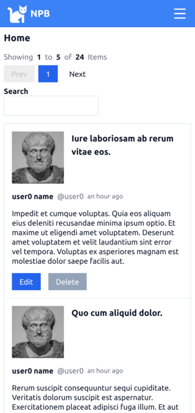
    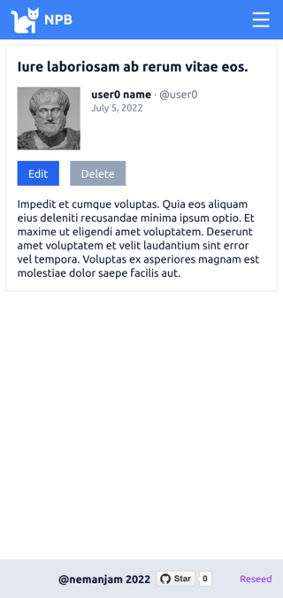
    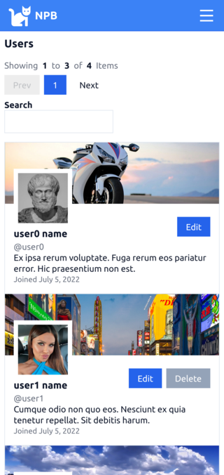
    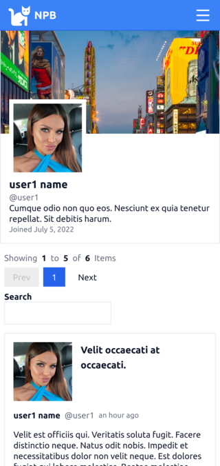
    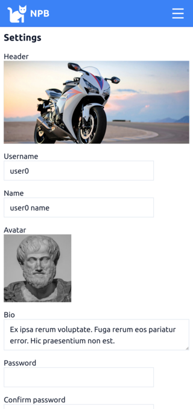

    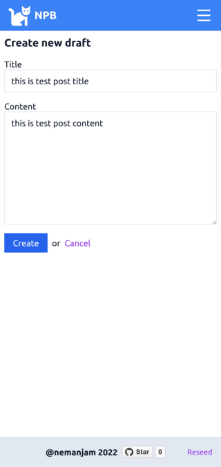
    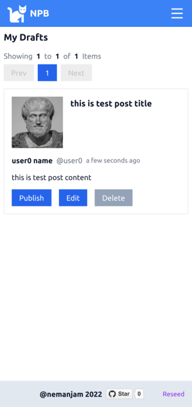
    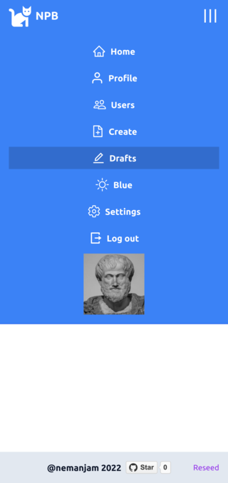
    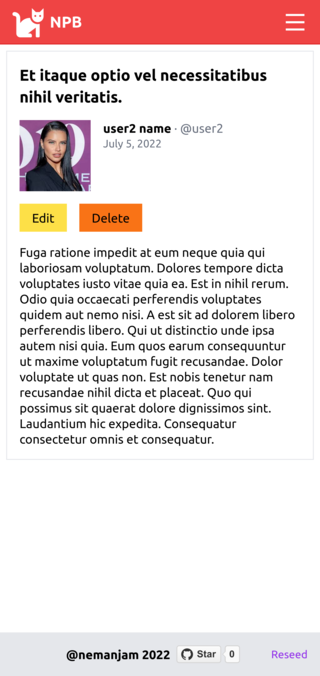
    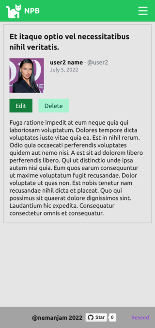

    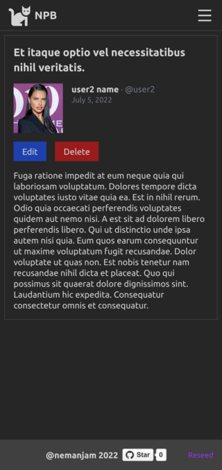
    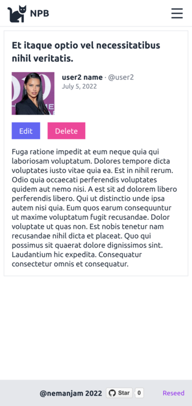
    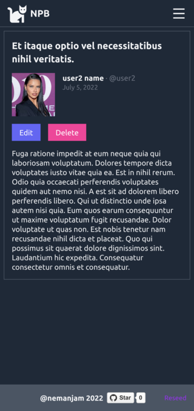
    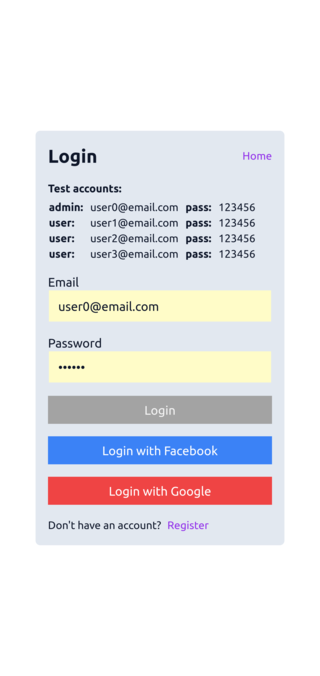
    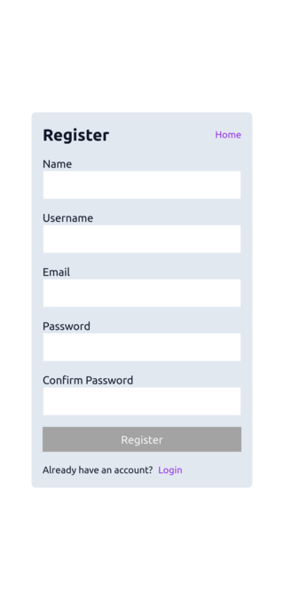

